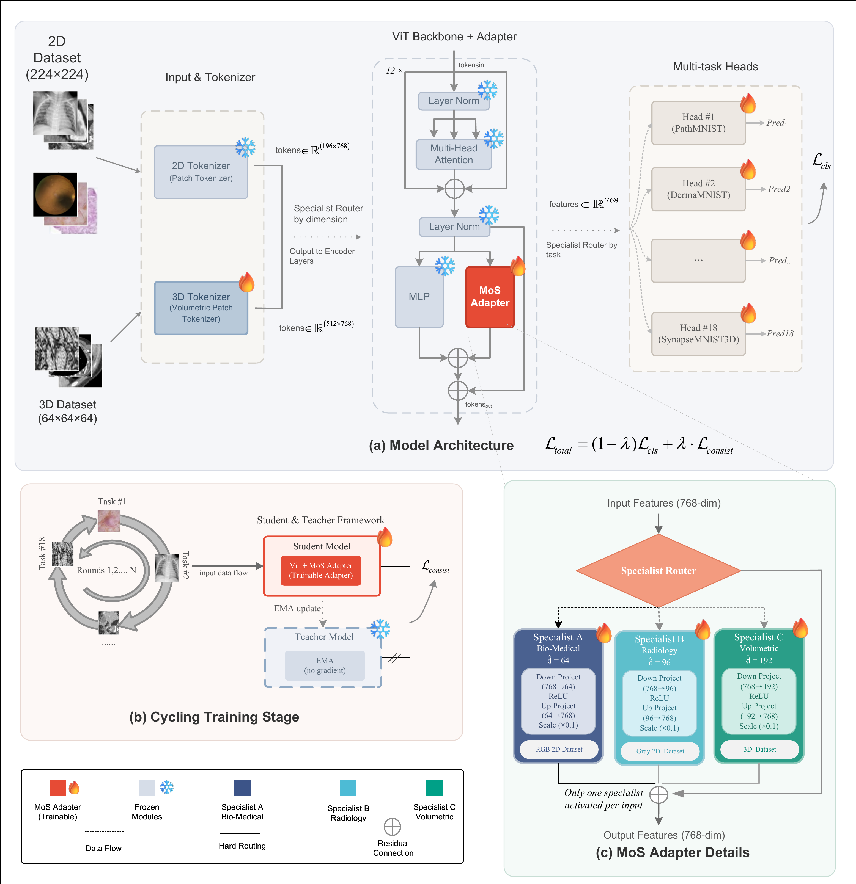

<div align="center">

# Bridging Heterogeneous Medical Datasets via<br>Mixture-of-Specialists Adapters

[](#)
[](LICENSE)
[](https://www.python.org/)
[](https://pytorch.org/)

</div>

## TL;DR

**MOSAIC** trains only **7.40M parameters (7.9%)** on a frozen ViT-B/16 and achieves **84.16% average accuracy** across 18 MedMNIST datasets (6 modalities, 2D+3D) — matching or exceeding 18 single-task specialists that collectively require 16× more storage.

<p align="center">
  
</p>

## Why This Matters

Naïvely mixing heterogeneous medical data (pathology + radiology + CT + 3D volumes) causes negative transfer — texture-biased and shape-biased features interfere with each other, and joint training actually *underperforms* single-task baselines (77.66% vs 81.86%).

MOSAIC fixes this with a dead-simple idea: **hard-route each input to a structurally isolated specialist adapter**. No learnable gating, no mode collapse. Three specialists handle three feature families:

| | Domain | Bottleneck | Datasets |
|:---:|:---|:---:|:---|
| **A** | Bio-Medical (RGB) | 64 | PathMNIST, BloodMNIST, TissueMNIST, DermaMNIST, RetinaMNIST |
| **B** | Radiology (Grayscale) | 96 | ChestMNIST, PneumoniaMNIST, BreastMNIST, OCTMNIST, OrganA/C/SMNIST |
| **C** | Volumetric (3D) | 192 | OrganMNIST3D, NoduleMNIST3D, AdrenalMNIST3D, VesselMNIST3D, FractureMNIST3D, SynapseMNIST3D |

The asymmetric capacity (64 → 96 → 192) reflects intrinsic dimensionality: 2D texture/shape patterns are more redundant; 3D volumes need more capacity for spatial dependencies.

## Quick Start

```bash
# 1. Clone & install
pip install -r requirements.txt

# 2. Download ViT-B/16 backbone (ImageNet-21k)
wget https://storage.googleapis.com/vit_models/imagenet21k/ViT-B_16.npz -O vit_base_patch16_224.npz

# 3. Train (MedMNIST datasets download automatically)
python main.py \
    --data_root ./data \
    --pretrained ./vit_base_patch16_224.npz \
    --adapter_mode v2_moe \
    --freeze_backbone \
    --num_rounds 100 \
    --batch_size 32 \
    --lr 1e-4 \
    --adapter_bottleneck_a 64 \
    --adapter_bottleneck_b 96 \
    --adapter_bottleneck_c 192 \
    --ema_momentum 0.9 \
    --ema_momentum_3d 0.95 \
    --consist_weight 0.1 \
    --early_stopping_patience 5 \
    --seed 42

# 4. Evaluate
python testing.py \
    --checkpoint ./output/best_model.pth \
    --data_root ./data \
    --adapter_mode v2_moe
```

## Codebase

| | |
|:---|:---|
| `model/adapter.py` | **MoS adapter — core contribution** |
| `model/patch_embed.py` | Modality-aware 2D/3D tokenizer |
| `model/unified_model.py` | Full model, EMA teacher, weight loading |
| `engine/trainer.py` | Cyclic training with consistency loss |
| `engine/evaluator.py` | Multi-task evaluation (ACC/AUC) |
| `config/datasets.py` | Dataset registry & routing table |

## Acknowledgements

Built on [MedMNIST](https://medmnist.com/), [AdaptFormer](https://arxiv.org/abs/2205.13535), [Ark](https://arxiv.org/abs/2110.05006), and [MedCoSS](https://arxiv.org/abs/2305.12850).
